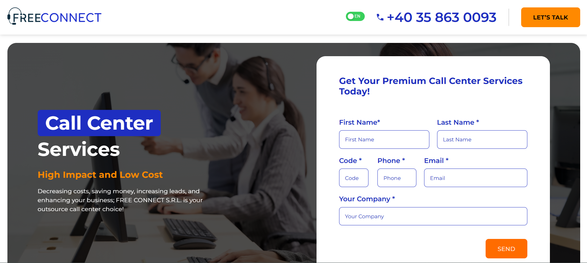
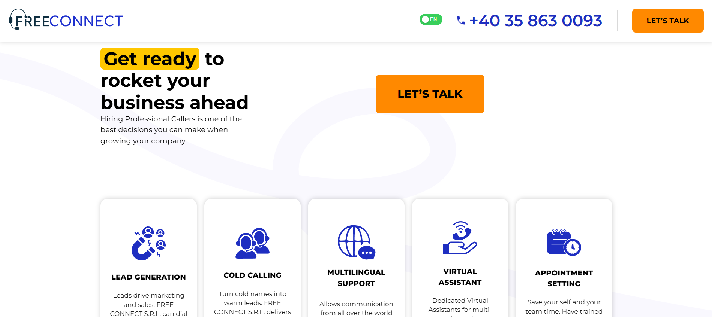
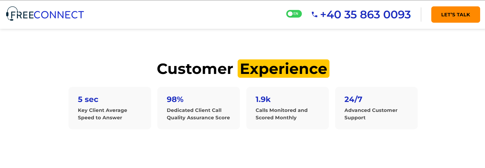
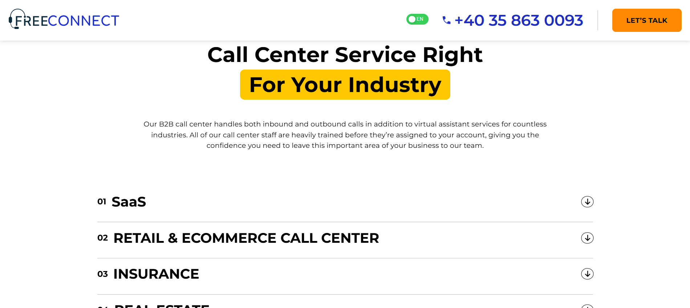
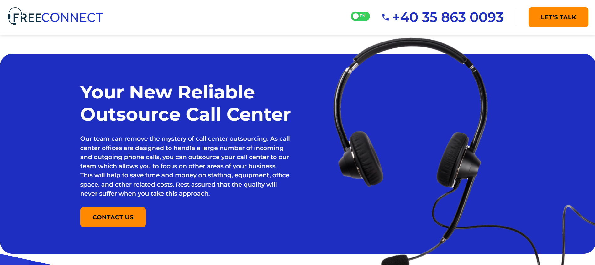
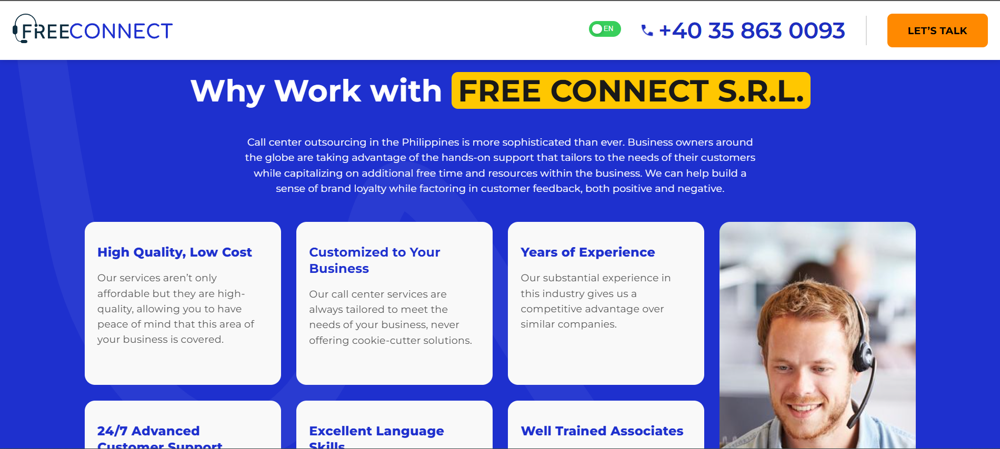
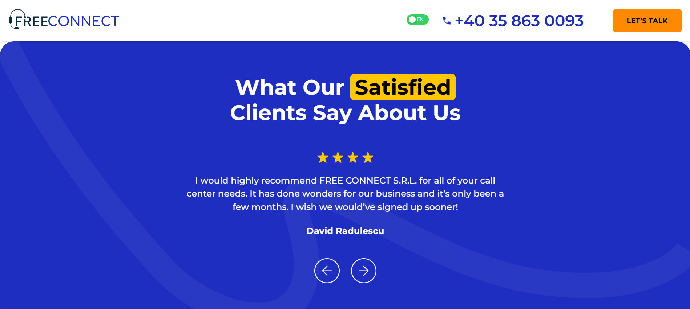
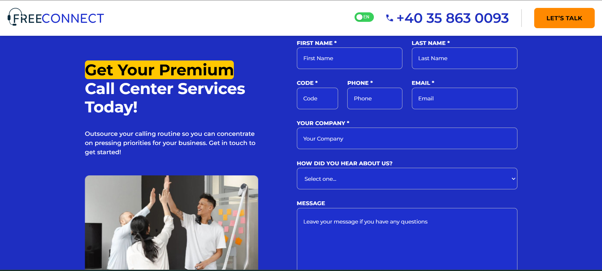

# FreeConnect

## Multilingual Business Website Developed and Deployed for Production

**FreeConnect** is the first production-ready website I built at work, successfully deployed and used in real-world scenarios.  
The project includes full **multilingual support** with language switching between **English** and **Romanian**.

All text content and images were tailored specifically to meet the client’s branding and functionality requirements.

---

## 🏠 Home Page

## 🌍 What the Company Offers

## 👥 Customer Experience

## 🛠️ Services

## 📞 Call-to-Action Section

## 🤝 Why Work With Us

## 💬 Client Testimonials

## 🧑‍💼 Words from the CEO

## 📬 Contact Form

---

## 🔗 Live Website

[Visit FreeConnect](http://freeconnect.ro/)